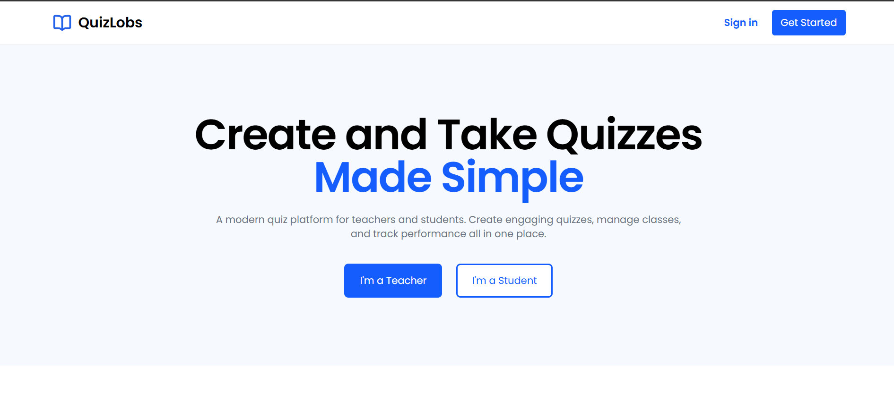

# QuizLobs 🧠📚

QuizLobs is a web-based quiz management system designed for teachers and students. It allows teachers to create classes, build quizzes, and manage students, while students can join classes and take quizzes in a clean and organized interface. The project focuses on simplicity, clarity, and modern web development practices.

## 🖼️ Landing Page

## 🚀 Features
**Teacher**
- Create and manage classes
- Create quizzes with multiple questions
- Assign quizzes to specific classes
- Manage students within a class

**Student**
- Join classes
- View available quizzes
- Take quizzes online
- Receive quiz results (planned feature)

## 🛠️ Tech Stack
- Frontend: React + Vite  
- Styling: Tailwind CSS  
- Routing: React Router (HashRouter for GitHub Pages compatibility)  
- Package Manager: npm  

## 🎯 Project Goals
- Practice modern React development
- Apply component-based architecture
- Build a clean and intuitive educational UI
- Prepare a scalable foundation for future backend integration

## 🔮 Future Improvements
- Authentication (Teacher / Student roles)
- Backend API and database integration
- Quiz scoring and result analytics
- Timer-based quizzes
- Role-based access control

## 📄 License
This project is developed for educational purposes and may be freely modified for learning and personal use.
